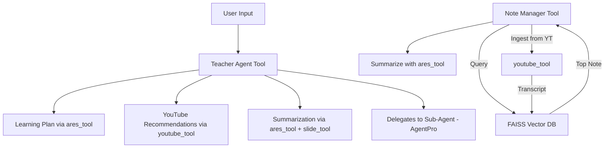

# 🧠 Teacher Agent (Traversaal x Optimized AI Hackathon)

Welcome to **Teacher Agent**, a smart AI-driven learning assistant built using the AgentPro-Ex framework and custom tool. AgentPro-Ex is our extension of the AgentPro framework that adds accessibility by allowing the usage of OpenRouter in addition to OpenAI. The Teacher Agent is your self-sufficient advisor agent who helps develop learning paths for the topics you are interested in. Teacher Agent is capable of:

- Creating structured learning paths,
- Recommending high-quality educational YouTube videos,
- Summarizing topics and generating study notes,
- Searching and managing your notes using embeddings,
- Creating slides of contents,
- Integrating multiple AI capabilities under one unified system.
  
<p align="center">
  
  
</p>

## ✨ Features

### 🎓 Planner Tool
Acts as your tutor:
- planned deep learning: Breaks broad topics into structured, digestible subtopics.
- recommend videos: Find and suggest relevant YouTube videos.
- summarize notes: Summarize web/YT content into concise notes.

### 📝 Note Manager Tool
Enhances your note-taking experience:
- stores your notes and YouTube transcripts.
- Lets you search, retrieve, and summarize notes contextually.

### 🔓 OpenRouter API
Utilize different models from the OpenRouter platform or default to OpenAI models.

## 🛠️ Tech Stack & Agent Architecture

- **LLM Gateway**: OpenRouter + OpenAI (via AgentPro)
- **Framework**: AgentPro – multi-agent orchestration
- **Tools Used**:
    - ares_tool – web search and summarization
    - youtube_tool – fetch and transcribe YouTube videos
    - slide_tool – structured slide/notes generator
    - planner_tool - recommends YouTube videos, summarizes content, plans learning paths, and helps make study notes for any topic.
    - note_manager_tool - search and summarize top relevant notes from YouTube or stored data.
- **Vector DB**: FAISS (for storing and retrieving embedded notes)
- **Embedding Model**: SentenceTransformers

## Quick Start

### ⚙️ Installation

1. Clone the repository and install the required packages:

```bash
git clone [https://github.com/yourusername/agentpro.git](https://github.com/SidWorks01/Traversaal-x-Optimized-AI-Hackathon.git)
cd Traversaal-x-Optimized-AI-Hackathon
```

2. Create a Virtual Environment & Install Dependencies:

```bash
python -m venv venv
source venv/bin/activate  # On Windows: venv\Scripts\activate
pip install -r requirements.txt
```

3. Configuration
You will need API keys for:
  - OpenRouter or OpenAI
  - Traversaal API key for ares_tool

  Create a `.env` file in the root directory with your API keys:
  For OpenRouter:
  ```
TRAVERSAAL_ARES_API_KEY=your_traversaal_ares_api_key
OPENROUTER_API_KEY=your_openrouter_api_key
MODEL_NAME=your_choice_of_openrouter_model_id
```
  For OpenAI:
  ```
  TRAVERSAAL_ARES_API_KEY=your_traversaal_ares_api_key
  OPENAI_API_KEY=your_openai_api_key
  MODEL_NAME=your_choice_of_openai_model_id
  ```

### Launch the gradio app

From the command line :

```bash
./launch_gradio.sh
```
### 🚀 Running the Agent

From the command line:

```bash
python main.py
```

This starts an interactive session with the agent where you can enter queries.

## Basic Usage

```python
import sys
sys.path.append("/content/AgentPro-Hackathon")

from run_agent_once import run_agent_once

response = run_agent_once("Create a note on Attention in Large Language Models.")
print(response)
```

```bash
Here's the generated note on Attention in Large Language Models based on the note_manager tool's summary:

**Note: Attention in Large Language Models**

Attention mechanisms are a cornerstone of modern LLMs, enabling them to process and understand complex sequences of data effectively.

- **Core Concept:** Attention allows the model to dynamically focus on different parts of the input, assigning weights to tokens based on their relevance.
- **Mechanism:** Involves queries, keys, and values in a mathematical formulation to compute attention scores.
- **Types:** Self-attention for intra-sequence relationships and multi-head attention for capturing diverse features.
- **Significance:** Powers models like GPT and BERT for tasks such as text generation and comprehension.
- **Challenges:** Computational intensity, but advancements continue to optimize it.

You can use this note for quick reference or expand it further if needed. If you'd like me to enhance it, recommend videos, or create slides, let me know!
```

## 🧩 Architecture Diagram


## Project Structure

```
Traversaal-x-Optimized-AI-Hackathon/
├── agentpro/
│   ├── __init__.py
│   ├── agent.py                  # Main agent implementation
│   ├── agentpro_tests.ipynb      # Tests and demo notebook
│   ├── app.py                    # Gradio implementation
│   ├── launch_gradio.sh          # Launch gradion script
│   ├── tools/
│   │   ├── __init__.py
│   │   ├── base.py               # Base tool classes
│   │   ├── ares_tool.py          # Internet search
│   │   ├── code_tool.py          # Code generation
│   │   ├── youtube_tool.py       # YouTube analysis
│   │   ├── slide_tool.py         # Presentation generation
│   │   ├── planner_tool.py       # Plan learning
|   |   └── note_manager_tool.py  #Manage Notes
│   └── examples/
│       ├── __init__.py
│       └── example_usage.py      # Usage examples
├── main.py                       # CLI entry point
├── run_agent_once.py             # entry point for Gradio and Colab Demo 
├── requirements.txt              # Dependencies
└── .env                          # API keys (create this file)
```

## Requirements

- Python 3.8+
- Open Router API Key or OpenAI API key
- Traversaal Ares API key (for internet search)

## License

This project is licensed under the Apache 2.0 License - see the LICENSE file for more details.
